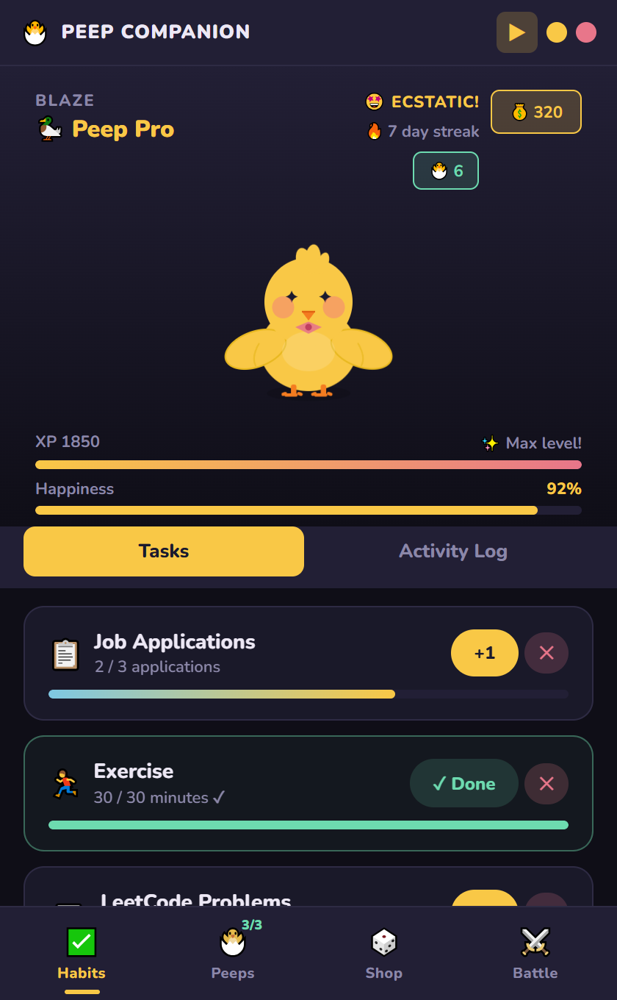
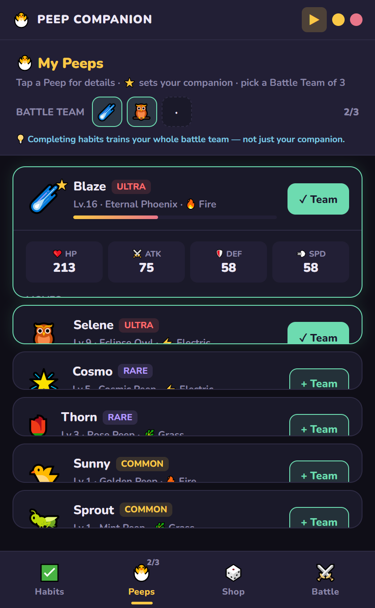
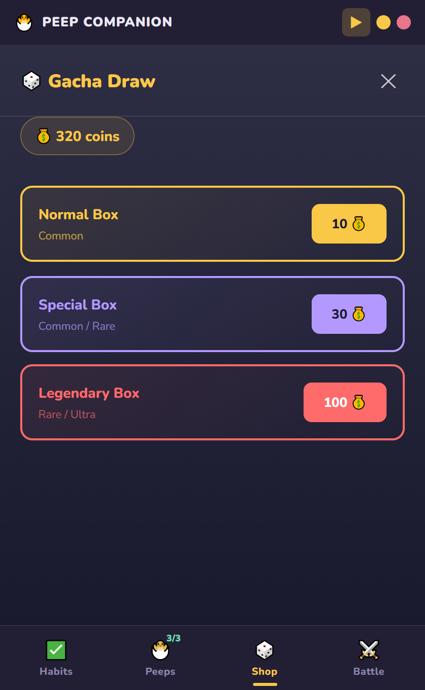
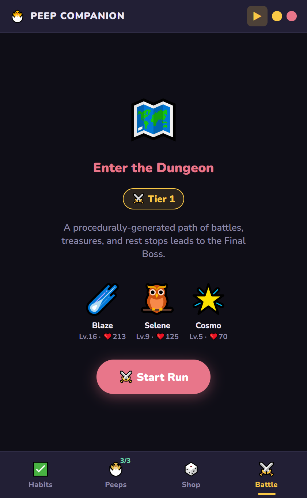
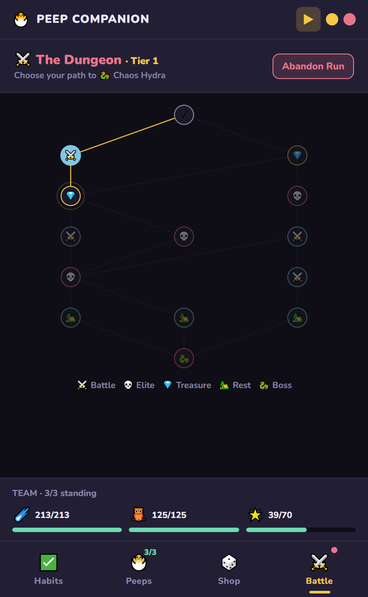
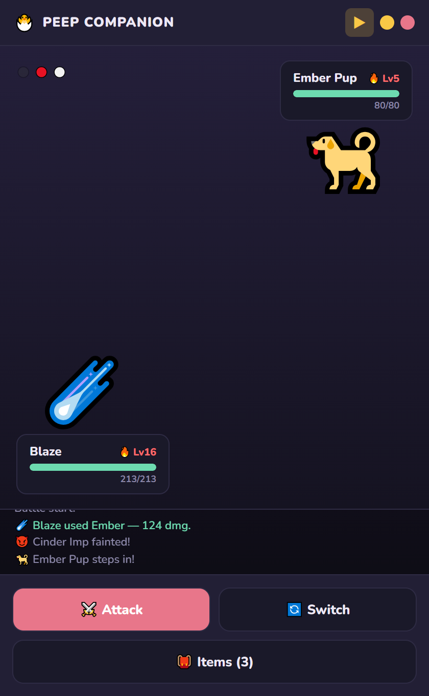

# 🐣 Peep Companion

> **Do your habits. Raise your Peeps. Conquer the dungeon.**

A Windows desktop game that fuses a **habit tracker**, a **monster-catcher (gacha)**, and a
**turn-based roguelite battler** into one loop:

> Complete real-life habits → earn **Gold** + **XP** → collect & evolve **Peeps** →
> take a team of 3 into a procedurally-generated dungeon → beat the Final Boss for a permanent reward.

Built with **Electron + React + Vite**. See [ARCHITECTURE.md](ARCHITECTURE.md) for the full design,
data schemas, and state machine.

---

## 📸 The game, mechanic by mechanic

### Phase A — Habit Tracker & Peep Growth


Your home screen. Create count-based goals (*"Apply to 3 jobs"*) or timed sessions (*"Study 45 min"*).
Every completion awards **Gold** and **XP**, raising happiness and pushing your Peep toward its next
growth stage. Finish all your tasks to extend your daily **streak**, and an activity log records
everything you've earned.

- ✅ Custom tasks with per-day goals that reset at midnight
- 💰 Gold + ⚡ XP on every check-in — XP feeds your **whole battle team**, not just the companion
- 🔥 Daily streaks (advance by clearing the day), happiness decay, live XP / happiness readout
- 🔔 A native **daily reminder** nudges you at 7 PM if tasks remain
- 🐤 A floating "mini" companion window (system tray) for quick check-ins

<br clear="all" />

### Phase B — Collect, Evolve & Build a Team


Every Peep is a battler. Tap one to reveal its **derived battle stats** (HP / ATK / DEF / SPD),
**element**, and **moveset** — all computed from its level and evolution form, so leveling a Peep
through habits literally makes it stronger in combat. Peeps **grow up** into new forms at level
thresholds (e.g. *Golden Peep → Solar Chick → Blaze Phoenix*).

Here you also pick your **Battle Team of exactly 3** — the gate into the dungeon — and choose which
Peep is your active companion (⭐).

<br clear="all" />

### Phase B — The Gacha Shop


Spend the Gold you earned from real habits to pull for new Peeps. Three crates trade cost for odds:

| Box | Cost | Pool |
|-----|------|------|
| 🟡 Normal | 10 | Common |
| 🟣 Special | 30 | Common / Rare |
| 🔴 Legendary | 100 | Rare / Ultra |

Rarer Peeps come with stronger base stats and flashier evolutions — the reward for staying consistent.

<br clear="all" />

### Phase C — Enter the Dungeon


With a full team of 3, the dungeon unlocks. Each run is a fresh, procedurally-generated gauntlet at an
**ascension tier** — every run pushes one tier past your best, scaling difficulty *and* rewards.
Before diving in you see your squad's levels and HP — the team you built through weeks of habits.

HP and items carry **between fights within a run**, but reset when the run ends, so every dive is a
self-contained push toward the boss.

<br clear="all" />

### Phase C — The Node Map


A Slay-the-Spire-style branching map. Choose your path through **battles**, **elites** (⚔️ harder,
better loot), **treasures** (💎 run items), and **rest** stops (🏕️ heal 50%) — all leading to the
🐉 **Final Boss**. Your route is yours to plan; the highlighted nodes are the moves available now.

A team-status bar tracks who's still standing across the whole run.

<br clear="all" />

### Phase C — Turn-Based Combat


Pokémon-style battles with your team of 3 vs. enemy monsters. Pick **moves**, **switch** active
Peeps, or use **items** — speed decides turn order, and an **elemental type chart** (fire/water/
grass/electric) rewards smart matchups.

- 🔥 **Status effects** — burn, poison, paralysis, and frostbite (damage-over-time + skipped turns)
- 💖 **Items** — potions, stat tonics, and revives (consumed from your run inventory)
- 💾 **Mid-fight persistence** — a fight lives in your save, so closing the app mid-battle resumes
  it exactly where you left off
- 🐲 **Boss variety** — each run draws one of several themed bosses, dropping a pre-leveled themed Peep
- 🏆 Clearing a tier banks ascension progress + permanent rewards; the next run unlocks a tougher tier

<br clear="all" />

---

## 🚀 Getting started

```bash
cd peep-companion-src
npm install
npm run dev      # launches Vite + Electron
```

Build a distributable Windows installer:

```bash
npm run build    # vite build + electron-builder (NSIS)
```

The app also runs in a plain browser (`npm run dev` exposes Vite on `:5173`) using a `localStorage`
save mock — handy for quick iteration without Electron.

---

## 🧱 Tech & structure

**Electron + React + Vite.** The game is menu- and data-driven with *turn-based* combat, which React
models cleanly; the combat engine is a pure, serializable module the UI just renders. See
[ARCHITECTURE.md](ARCHITECTURE.md) for the rationale and full file map.

```
peep-companion-src/src/
  App.jsx            load/save, onboarding, mini-mode
  GameShell.jsx      the state machine (Habits / Peeps / Shop / Battle) + run lifecycle
  Dashboard.jsx      Phase A — habit tracker
  TeamSelect.jsx     Phase B — collection, companion, battle team
  Gacha.jsx          Phase B — gacha shop
  BattleMap.jsx      Phase C — node map
  Battle.jsx         Phase C — turn-based combat UI
  game/
    battle.js        leveling, evolution, stats, elements, moves, statuses, enemies, items
    combat.js        pure turn-based combat engine (persist/resume-safe)
    mapGen.js        procedural node-map generator
```

---

## 🖼️ Regenerating the screenshots

The screenshots above are produced automatically by driving the app in a headless browser with
seeded save states (no manual capture):

```bash
cd peep-companion-src
npx vite                                                   # serve on :5173, then in another shell:
node --experimental-default-type=module scripts/build-scenes.mjs   # build save states -> docs/scenes.json
node scripts/shoot.cjs                                     # screenshot each scene -> docs/screenshots/
```

`build-scenes.mjs` constructs the save states using the real game modules (so they're always valid),
and `shoot.cjs` uses `puppeteer-core` to drive the installed Microsoft Edge.
